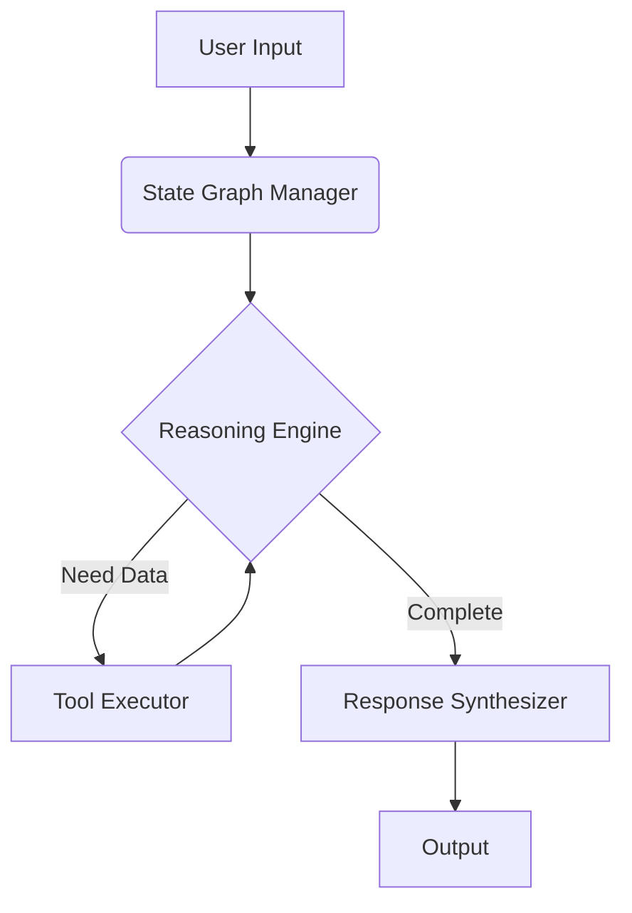
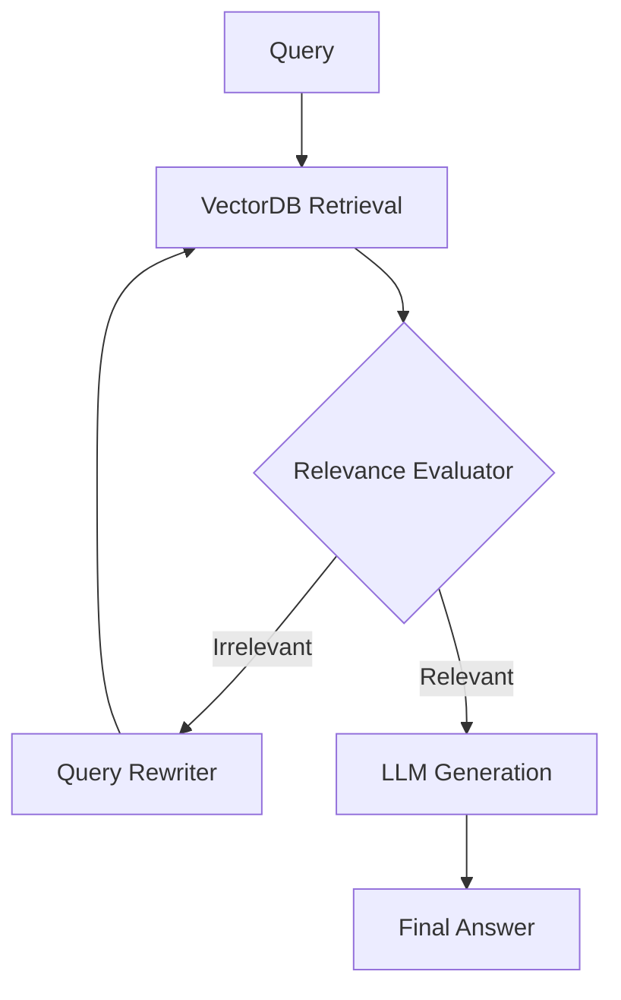
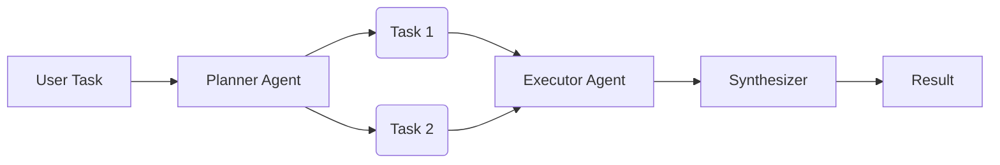
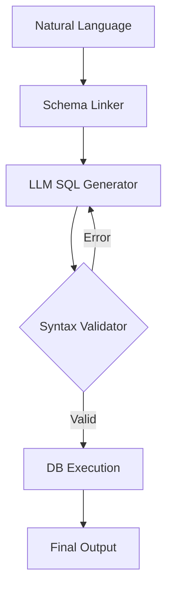

<!-- Header — waving type, full name always visible -->
<div align="center">

</div>

<!-- Animated Open to Work + Social row -->
<div align="center">
  
  &nbsp;
  
  &nbsp;
  
  &nbsp;
  
</div>

<br/>

<!-- Typing SVG -->
<div align="center">

[](https://git.io/typing-svg)

</div>

<!-- Badges row -->
<div align="center">
  
  &nbsp;
  
  &nbsp;
  
</div>

<br/>

---

<div align="center">
  
</div>

<h3 align="center">
  <i>"I don't just write code. I architect intelligence."</i>
</h3>

<p align="center">
  
</p>

<p align="center">
  Hi, I'm Shikhar. I am an AI/ML Engineer currently pursuing my Computer Science degree at Bennett University and advancing my research through an internship at <b>IIIT Allahabad</b>. While academia provides the foundation, my real classroom is the terminal. I spend my nights debugging complex ETL pipelines and building AI architectures that can handle the unpredictability of the real world. 
</p>

<p align="center">
  Whether it's deploying a Stock Market Intelligence RAG or an NCR Urban Analytics Platform, I believe in one absolute truth: <b>engineering is about solving real problems with real data</b>. 
</p>

<p align="center">
  
  <br>
  <b>Next Stop: AI/ML Placements 2025</b>
</p>

---

## 🎮 Fun Stats

<div align="center">

```
☕  Cups of coffee consumed          ████████████████████  900+
🐛  Bugs squashed                    ███████████████░░░░░  1,400+
🤖  RAG pipelines built              ████████░░░░░░░░░░░░  8+
🌙  Commits pushed after 2am         ██████████████░░░░░░  250+
📊  Real data rows processed         ████████████████████  200K+
🔁  "It works on my machine" moments ███░░░░░░░░░░░░░░░░░  getting better
```

</div>

---

## 🛠️ Skill Icons

<div align="center">

### Languages
[](https://skillicons.dev)

### AI / ML / Data
[](https://skillicons.dev)

### Backend & Frameworks
[](https://skillicons.dev)

### Databases & Cloud
[](https://skillicons.dev)

### Tools & DevOps
[](https://skillicons.dev)

</div>

---

## 🚀 Featured Projects

<table width="100%">
  <tr>
    <td width="50%" valign="top">
      <h3>🤖 AgentForge</h3>
      <p>
        A production-grade, custom framework for building autonomous agents. 
        Engineered for complex tool-calling, multi-step cyclic reasoning, and state management.
      </p>
      <p>
        
        
        
      </p>
      <details>
        <summary>💡 What I learned building this</summary>
        <ul>
          <li>State-graph management is superior to linear chain execution.</li>
          <li>Handling tool-calling edge cases requires robust fallback states.</li>
          <li>Cyclic reasoning loops allow agents to self-correct during execution.</li>
        </ul>
      </details>
      <details>
        <summary>🏗️ Architecture Diagram</summary>
        

      </details>
      <a href="https://github.com/Shikhar-Kesharwani/AgentForge">
        
      </a>
    </td>
    <td width="50%" valign="top">
      <h3>🎯 PLACEMENT_PREP_CRAG</h3>
      <p>
        A Corrective Retrieval-Augmented Generation (CRAG) system built to optimize interview prep. 
        It evaluates its own retrieved context, rewrites queries if irrelevant, and generates highly accurate answers.
      </p>
      <p>
        
        
        
      </p>
      <details>
        <summary>💡 What I learned building this</summary>
        <ul>
          <li>Standard RAG fails when context is noisy; an LLM evaluator step is mandatory.</li>
          <li>Query rewriting dramatically improves retrieval precision on the second pass.</li>
          <li>VectorDB chunking strategies dictate the ultimate quality of generation.</li>
        </ul>
      </details>
      <details>
        <summary>🏗️ Architecture Diagram</summary>
        

      </details>
      <a href="https://github.com/Shikhar-Kesharwani/PLACEMENT_PREP_CRAG">
        
      </a>
    </td>
  </tr>
  <tr>
    <td width="50%" valign="top">
      <h3>🧠 PLAN_AND_EXECUTE_AGENT</h3>
      <p>
        An advanced autonomous agent using the Plan-and-Execute pattern. It dynamically breaks down highly complex, vague user requests into step-by-step DAGs and executes them autonomously.
      </p>
      <p>
        
        
        
      </p>
      <details>
        <summary>💡 What I learned building this</summary>
        <ul>
          <li>Decoupling the Planner from the Executor prevents LLM hallucination on complex tasks.</li>
          <li>Dynamic DAGs (Directed Acyclic Graphs) allow for parallel task execution.</li>
          <li>Agent memory is critical for passing context between execution steps.</li>
        </ul>
      </details>
      <details>
        <summary>🏗️ Architecture Diagram</summary>
        

      </details>
      <a href="https://github.com/Shikhar-Kesharwani/PLAN_AND_EXECUTE_AGENT">
        
      </a>
    </td>
    <td width="50%" valign="top">
      <h3>🗣️ TEXT_TO_SQL Engine</h3>
      <p>
        A robust Natural Language Processing pipeline that translates complex English questions directly into optimized database queries, handling dynamic schema linking and syntax validation.
      </p>
      <p>
        
        
        
      </p>
      <details>
        <summary>💡 What I learned building this</summary>
        <ul>
          <li>Injecting DDL (Data Definition Language) into the prompt context is vital for accuracy.</li>
          <li>Self-correction loops allow the LLM to fix its own SQL syntax errors before execution.</li>
          <li>Few-shot prompting significantly reduces JOIN errors across multiple tables.</li>
        </ul>
      </details>
      <details>
        <summary>🏗️ Architecture Diagram</summary>
        

      </details>
      <a href="https://github.com/Shikhar-Kesharwani/TEXT_TO_SQL">
        
      </a>
    </td>
  </tr>
</table>

---

## 🛠️ Tech Stack

<div align="center">

### 🤖 AI / Machine Learning


### ⚙️ Frameworks & Databases


### 💻 Languages


### 🚀 DevOps & Cloud


### 🧰 Tools


</div>

<details>
<summary><h2>🗄️ Project Archive (17+ Advanced Builds)</h2></summary>
<br>
<p><i>A complete log of my local architectures, agentic builds, and data pipelines.</i></p>

<table width="100%">
  <tr>
    <td width="50%" valign="top">
      <h3>🤖 Agentic AI & RAG</h3>
      <ul>
        <li><b>AgentForge</b><br><i>Custom autonomous agent framework</i><br><kbd>LangGraph</kbd> <kbd>Python</kbd></li><br>
        <li><b>PLACEMENT_PREP_CRAG</b><br><i>Corrective RAG pipeline for interview prep</i><br><kbd>CRAG</kbd> <kbd>VectorDB</kbd></li><br>
        <li><b>PLAN_AND_EXECUTE_AGENT</b><br><i>Autonomous multi-step execution agent</i><br><kbd>LLMs</kbd> <kbd>Agents</kbd></li><br>
        <li><b>AGENTIC_AI_CHATBOT</b><br><i>Tool-calling conversational AI</i><br><kbd>OpenAI</kbd></li><br>
        <li><b>AI_CODE_REVIEWER</b><br><i>Automated LLM code review pipeline</i><br><kbd>FastAPI</kbd></li><br>
        <li><b>LLM_APP</b> & <b>OWN_AI_BUILD</b><br><i>Core custom LLM architectures</i><br><kbd>LLMs</kbd> <kbd>GenAI</kbd></li>
      </ul>
    </td>
    <td width="50%" valign="top">
      <h3>📊 Data & Spatial ML</h3>
      <ul>
        <li><b>chest_heart_detection</b> & <b>heart_disease_prediction</b><br><i>Medical imaging & diagnostics ML</i><br><kbd>TensorFlow</kbd> <kbd>Scikit-learn</kbd></li><br>
        <li><b>Nabha TeleMedicine</b> (v3, v6, v7)<br><i>Iterative telemedicine architecture</i><br><kbd>React</kbd> <kbd>Node.js</kbd></li><br>
        <li><b>Time_Series_Detection</b> & <b>SPATIAL_ANALYSIS</b><br><i>Temporal & geospatial pipelines</i><br><kbd>Pandas</kbd> <kbd>PostGIS</kbd></li><br>
        <li><b>TEXT_TO_SQL</b><br><i>NLP to database query engine</i><br><kbd>NLP</kbd> <kbd>SQL</kbd></li>
      </ul>
    </td>
  </tr>
  <tr>
    <td colspan="2" valign="top">
      <h3>🌐 Networking & Core Infrastructure</h3>
      <ul>
        <li><b>DEEP_PACKET_INSPECTION</b><br><i>Byte-level packet payload security analysis</i><br><kbd>C++</kbd> <kbd>Networking</kbd></li><br>
        <li><b>dns_resolver</b><br><i>Custom Domain Name System implementation</i><br><kbd>Python</kbd> <kbd>Sockets</kbd></li>
      </ul>
    </td>
  </tr>
</table>
</details>

---

## 📊 GitHub Stats

<div align="center">
  
</div>

---

## 🗓️ 3D Contribution Calendar

<div align="center">
  
</div>

---

## 📈 Contribution Activity

<div align="center">
  
</div>

---

## 🎯 Current Focus

<table>
  <tr>
    <td>🔨 Building</td>
    <td>Stock Market Intelligence RAG with Langfuse full observability</td>
  </tr>
  <tr>
    <td>🔨 Building</td>
    <td>NCR Urban Intelligence Platform — 68+ localities, real-data only</td>
  </tr>
  <tr>
    <td>📚 Learning</td>
    <td>Corrective RAG · Adaptive RAG · Hierarchical Agent Teams · LangGraph</td>
  </tr>
  <tr>
    <td>🎯 Target</td>
    <td>AI/ML Placements 2025 — SDE/MLE roles in India's AI ecosystem</td>
  </tr>
  <tr>
    <td>🌍 Domains</td>
    <td>Indian Agriculture · Urban Analytics · Financial AI · NLP</td>
  </tr>
  <tr>
    <td>📍 Location</td>
    <td>Prayagraj, Uttar Pradesh, India</td>
  </tr>
</table>

---

## 📚 Currently Exploring

> Things I'm reading, researching, or experimenting with this month

- 📖 **"Designing Data-Intensive Applications"** — Kleppmann (systems design bible)
- 🤖 **Agentic RAG** — LangGraph multi-agent orchestration, tool-calling patterns
- 🔍 **Hybrid retrieval** — BM25 + dense + reranker: when each wins
- 🌐 **Systems internals** — DNS, TCP, HTTP at the byte level (building, not just reading)
- 🧠 **Placement deep dives** — OS, CN, DBMS, System Design

---

## 💡 My Engineering Principle

<div align="center">

> **"Real data only. No synthetic shortcuts."**
>
> Every project I build uses verified, authentic datasets —
> ICRISAT, NASA POWER, RBI, OpenStreetMap, NSE.
> If the data doesn't exist, I document the gap honestly
> rather than fabricate numbers to make the dashboard look nice.

</div>

---

## 😂 Random Dev Joke

<div align="center">
  
</div>

---

## 💬 Dev Quote

<div align="center">
  
</div>

---

## 🤝 Connect With Me

<div align="center">

**Open to internships, FTE roles, hackathon collabs, and open-source contributions**

[](https://linkedin.com/in/shikhar-kesharwani)
[](https://github.com/Shikhar-Kesharwani)
[](mailto:your-email@gmail.com)

</div>

---

<!-- Snake animation -->
<div align="center">
  <picture>
    <source media="(prefers-color-scheme: dark)" srcset="https://raw.githubusercontent.com/Shikhar-Kesharwani/Shikhar-Kesharwani/output/github-contribution-grid-snake-dark.svg" />
    <source media="(prefers-color-scheme: light)" srcset="https://raw.githubusercontent.com/Shikhar-Kesharwani/Shikhar-Kesharwani/output/github-contribution-grid-snake.svg" />
    
  </picture>
</div>

<!-- Footer -->
<div align="center">
  
</div>

<!--
=============================================================
  GITHUB ACTIONS TO SET UP (.github/workflows/)
=============================================================

1. snake.yml          — contribution snake animation
2. 3d-contrib.yml     — 3D isometric contribution calendar
3. metrics.yml        — GitHub metrics infographic

All use GITHUB_TOKEN (auto-provided, no setup needed).
Run each once manually via Actions tab → Run workflow.
=============================================================
-->
